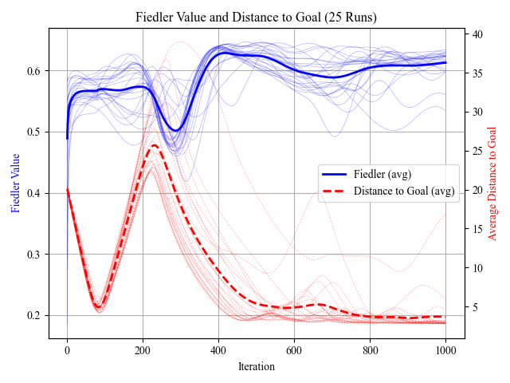

# Force-based Sheep Herding Simulation

This MATLAB project simulates a force-based model for sheep herding using autonomous "dogs" that guide sheep toward a defined goal area. The simulation visualizes the movement of sheep and dogs over time using a 2D animated plot.

<div align="center">
  
</div>

The underlying dynamics are based on the model presented in the paper:

[Herd guidance by multiple sheepdog agents with repulsive force](https://link.springer.com/article/10.1007/s10015-021-00726-7) by Kubo, M., Tashiro, M., Sato, H., et al. (2022).


Our contribution:
- added advanced vision mode

for more information check out:
DONT FORGET TO ADD PAPER WHEN DONE

## Project Structure

```
src
├─ main.m        # contains the main simulation code
└─ plot_util.m   # contains plotting functions
```

## Overview

The herding system models the interaction between:

- **Sheep**: agents that move based on repulsion from dogs and other sheep.
- **Dogs**: agents that apply forces to guide sheep toward a target.
- **Goal**: goal position

Each agent's behavior is governed by simple force-based rules that mimic realistic group dynamics.

## Features

- Run simulation with different number of dog and sheep agent
- 2D visualization for the herding process
- Run multiple simulation with different parameters for statistical analysis
- Allows for connectivity analysis via algebraic connectivity (i.e. fiedler value over iterations)

<div align="center">
    
</div>

## Getting Started

### Prerequisites

- MATLAB_R2022b
- No additional toolboxes required

### Run the Simulation

1. Clone the repository:
    
    ```bash
    git clone <https://github.com/your-username/force-based-sheep-herding.git>
    cd force-based-sheep-herding/src
    ```
    
2. Open MATLAB and navigate to the `src` directory.
3. Run the simulation: main.m# Force-Based-Sheep-Herding-Algorithm

## Reference

Kubo, M., Tashiro, M., Sato, H., et al. (2022).  
**Herd guidance by multiple sheepdog agents with repulsive force**.  
*Artificial Life and Robotics*, 27, 416–427.  
[https://doi.org/10.1007/s10015-021-00726-7](https://doi.org/10.1007/s10015-021-00726-7)
